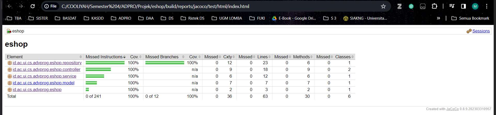

#### Nama : Muh. Kemal Lathif Galih Putra
#### NPM : 2206081225
#### Kelas : ADPRO - A
#### ASDOS : REN
#### Link Deployment: [Eshop-Kemal](https://production-qemul-adpro-eshop.koyeb.app/)

# TUTORIAL - 4
## Refleksi
1. Prosedur TDD membantu dalam membuat kode aman dan cepat. Test sebelumnya menjamin kode aman jika lulus. Perubahan 
kode dapat langsung diuji untuk mempermudah refactoring. Untuk lebih menjamin kebenaran kode, perlu ditambahkan pengujian interaksi fitur. Misalnya, testing untuk membuat,
mengupdate, dan mendelete 100 produk sekaligus untuk mengetahui interaksi tiga fitur berjalan dengan benar.


2. Menurut saya, test-test yang sudah saya buat sudah memenuhi prinsip F.I.R.S.T dengan 
algoritma testing seminimal untuk menguji kode seluruhnya, isolasi antar test yang tidak mempengaruhi hasil test lain, 
dan asersi yang memastikan kebenaran output dan dapat digunakan berulang-ulang untuk perubahan kode.

<hr>
<hr>

# TUTORIAL - 3
## Refleksi
### 1. Prinsip SOLID yang di implementasikan

- **Prinsip SRP**: 

  Prinsip SRP memberitahukan bahwa satu class seharusnya hanya memegang tanggung jawab atau mengerjakan 
  hanya satu aspek dari fungsionalitas. 

  Implementasi yang saya gunakan disini adalah memisahkan atau membedakan class `controller` antara
  `Homepage`,`Car`,dan `Product`. Dengan cara ini berarti setiap kelas hanya dapat menjalankan fungsi dari kegunaannya masing-masing
  tanpa intervensi dengan class lain.


- **Prinsip DIP**:

  Prinsip DRP memberitahukan bahwa suatu kodingan yang _high-level_ jangan berkaitan atau terikat
  dengan _low-level_. Semua harus terikat terhadap _abstraction_ (_not implementation_)
  
  Implementasi dari prinsip ini adalah `Car Controller` yang berkaitan dengan `Interface` dari `Service Car`
  tanpa bertaut dengan Implementasi dari interface tersebut.


- **Prinsip ISP**:
  
  Prinsip ISP memberitahukan bahwa suatu interface seharusnya dibagi menjadi interface yang lebih kecil
  sesuai dengan fungsi masing-masing.

  Implementasi dari ini adalah perbedaan `Interface` yang digunakan antara `Car` dan `Product` sehingga masing-masing
  interface dapat menjalankan fungsinya masing-masing.

**Note:**
  
  Beberapa prinsip yang masih bisa untuk diimplementasikan adalah OCP dengan membuat abstraction dari Car dan Product Reposetory, tetapi hal ini tidak
  saya lakukan dikarenakan perbedaan syntaks yang saya implementasikan pada Produk repo sebelumnya berbeda dengan Car Repo
  sehingga jika dibuat abstraction maka akan merubah test, service, dll. Mohon maaf atas kekuranngnya. Terima kasih.

### 2. Keunggulan atas implementasi SOLID

- **Memudahkan _tracking_ masalah dalam pengetestan kode**

    Penting untuk memecah kode menjadi unit-unit yang lebih kecil saat pengujian. Jika sebuah method panjang digunakan, sulit untuk mengidentifikasi 
    sumber kesalahan jika terjadi kegagalan saat pengujian.

    Dengan memisahkan method menjadi bagian yang lebih kecil, kita dapat dengan mudah menentukan sumber masalahnya. 
    Selain itu, jika ada ketergantungan tinggi antara class, pengujian akan menjadi sulit karena harus memperhitungkan hubungan antar class dan kemungkinan 
    perlunya menggunakan mock untuk ketergantungan tersebut.


- **Meningkatkan _Readibility Code_**

    Untuk meningkatkan keterbacaan kode, kita perlu memperhatikan panjang dan kompleksitas method. Method yang terlalu panjang dan kompleks bisa sulit dipahami oleh pembaca baru.

    Memecah method tersebut menjadi beberapa bagian yang lebih kecil dapat membantu pembaca memahami tujuan dan cara kerjanya dengan lebih jelas. 
    Kode yang lebih pendek cenderung lebih mudah dipahami dibandingkan dengan yang panjang.


- **Meningkatkan batasan dari dependency kode-kode (tidak merusak kode lain)**

    Perubahan pada kode tidak memengaruhi bagian lain karena menggunakan Dependency Inversion dengan interface. 
    Interface memastikan variabel sesuai dengan fungsi yang dibutuhkan.
  
    Sebagai contoh, sebuah kelas menggunakan objek A sebagai tipe data B, 
    perubahan pada fungsi dalam kelas tersebut harus tetap sesuai dengan interface agar tidak terjadi kesalahan. Jika menggunakan implementasi konkret dari B, A dapat dengan mudah mengubah fungsi yang dibutuhkan atau beralih ke interface lain.

### 3. Kerugian atas tidak implementasi SOLID

- **Kode akan menjadi sulit dipahami**. Seperti yang dijelaskan pada poin sebelumnya, 
  metode yang melakukan terlalu banyak tugas akan menjadi lebih sulit untuk didebug dan dipahami tujuannya.


- **Menguji kode akan sulit jika method yang ingin diuji 
  memiliki banyak ketergantungan** pada bagian lain dalam codebase atau terlalu kompleks. Proses pengujian unit akan memerlukan usaha ekstra 
  karena perlu mensimulasikan variabel yang dibutuhkan oleh method tersebut.


- **Kode sulit diubah** jika tidak mematuhi prinsip SOLID. 
  Hal ini dapat menyebabkan kerusakan pada modul lain atau memerlukan bongkar ulang implementasi saat mengubah tipe data yang diterima oleh sebuah method.

<hr>
<hr>

# TUTORIAL - 2
## Refleksi

### 1. _List Quality Code Issues_ yang sudah di fix

- Renaming bad function name:

    Sebelumnya ada beberapa function bawaan yang menggunakan snake case naming convention, disini
    saya mengubahnya menjadi Camel Case naming convention.

- Simply return value:

  Disini saya langsung return hasil dari beberapa fungsi di service tanpa harus membuat instasiasi variabel dulu.

- Mengubah modifier dari class interface service:

  Disini saya mengubah modifier yang sebelumnya public menjadi default tanpa public modifier.
  Ini dilakukan karena class merupakan interface class.

- Mengubah import dari annotation *:
  
  Dalam controller saya mengubah yang awalnya:
  ```java
  import org.springframework.web.bind.annotation.*
  ```
  Menjadi kode dibawah ini.
  ```java
  import org.springframework.web.bind.annotation.GetMapping;
  import org.springframework.web.bind.annotation.ModelAttribute;
  import org.springframework.web.bind.annotation.PostMapping;
  import org.springframework.web.bind.annotation.PutMapping;
  import org.springframework.web.bind.annotation.RequestMapping;
  import org.springframework.web.bind.annotation.PathVariable;
  import org.springframework.web.bind.annotation.DeleteMapping;
  ```

### 2. Implementasi kode sekarang untuk memenuhi CI/CD
Menurut saya, implementasi sekarang sudah dapat dikategorikan memenuhi basic CI/CD . Dengan github workflows, projek  kita  bisa otomatis melakukan testing dan deployment setiap kali push ke repository GitHub. 
Setiap push akan diuji dengan ci.yml dan diperiksa sekuritas dan kebenaran dari kode (bukan logic) dengan PMD. 
Setelah itu, kode akan di-merge ke branch main dan otomatis di-deploy ke PaaS Koyeb dengan action scorecard.yml, membentuk workflows pada Software Development Lifecycle dengan CI/CD.

## Bonus Grade:
code coverage 100%



<hr>
<hr>

# TUTORIAL - 1
## REFLEKSI 1
Jadi saya sudah mempelajari coding standart yang ada di modul seperti clean code, git flow, secure coding, hingga testing.

Berikut adalah beberapa penerapan dari coding standart yang diimplementasikan dalam code tutorial 1 saya.

### 1. Meaningful Names - Clean Code
Dari code tutorial 1 ini saya sudah mengimplementasikan standart code dari `meaningful names`, hal ini bisa dilihat dari
penamaan variabel dan fungsi yang jelas dan sesuai dengan kegunaannya.

Contoh:

-  variabel: `productId`, `productQuantity`, `productName`, `selectedProduct`, etc
-  fungsi: `create`, `updateProduct`, `deleteProduct`, `createProductPage`, etc

### 2. Function - Clean Code
Dari _function - function_ yang ada dalam code saya ini, semua nya saya usahakan untuk hanya melakukan satu hal saja sesuai kegunaannya. Function yang ada juga harusnya tidak memiliki efek samping.

Lalu baris dari _function - fucntion_ yang ada relatif pendek `(kecuali mungkin Testing)` yang merupakan salah satu penerapan dari materi bahwa function seharusnya pendek atau kecil.

Contoh:

Function Delete Product - Repository :
```java
//...
public Product deleteProduct(String id){
        for(Product product:productData){
            if(product.getProductId().equals(id)){
                productData.remove(product);
                return product;
            }
        }
        return null;
    }
//...
```

### 3. Comments - Clean Code
Dari function yang ada comments yang ada cukup minim karena sudah dideskripsikan di nama dari fungsinya sendiri.

### 4. Objects and Data Structure - Clean Code
Dari function yang dibuat, saya mengimplementasikan interface dan implementasinya di folder service untuk best practice
dan untuk dapat menjabarkan lebih lagi function yang diimplementasikan.

### 5. Feature Branch Workflow - Git FLow
Di tutorial ini saya menerapkan branch workflow untuk membuat dan memisahkan fitur-fitur yang ada
seperti `create`, `edit`, dan `delete` terhadap `main`. Ditambah ada branch `unit-test` dan `functional-test` untuk membedakan 

### 6. Unit-Test dan Functional-Test - Testing
Dari tutorial ini saya sudah menuliskan unit-test untuk `create`, `edit`, dan `delete` product ditambah
functional-test untuk mengecek interaksi dan tampilan dari ekspetasi page yang dikeluarkan.

#### Hal yang bisa diimprove:
- Error Handling bisa ditambahkan dan berada di function-function yang ada untuk bisa mengasih output edge case
yang bisa saja tidak sesuai dengan requirements dari function yang dibuat.


- Bisa untuk lebih rapiih dalam merging dan lebih teratur untuk branching workflow.


- Bisa untuk membuat coding yang lebih secure lagi agar tidak menjadi lebih rapih dan lebih aman dalam page kita berjalan.


- Membuat logic atau keluaran _function_ yang lebih spesifik mengikuti code standart yang dilakukan.

## REFLEKSI 2

### Setelah Menulis Unit Test:
Setelah menulis unit test, saya merasa yakin dan yakin bahwa bagian-bagian kode berperilaku sesuai yang diharapkan. Ini memberikan keyakinan penting saat membuat perubahan pada kode.

### Jumlah Unit Test dalam Kelas:
Di kelas ProductRepositoryTest, sudah ada beberapa unit test yang mencakup berbagai aspek dari ProductRepository. Jumlahnya sudah cukup, mencakup skenario pembuatan, pencarian, pembaruan, dan penghapusan produk.

### Memastikan Unit Test Sudah Cukup:
Unit test sudah mencakup skenario beragam, termasuk mencari produk berdasarkan ID, memperbarui produk, dan menangani kasus di mana produk tidak ditemukan. Penting untuk secara teratur meninjau dan memperbarui unit test ini.

### Code Coverage:
Meskipun tidak disertakan secara eksplisit, penggunaan alat cakupan kode akan membantu memahami sejauh mana kode diuji. Namun, perlu diingat bahwa cakupan kode 100% tidak menjamin ketiadaan bug.

### Suite Uji Fungsional Baru:
Untuk suite uji fungsional baru dari test untuk `number of items in the product list`, menurut pandangan saya, kebersihan kode mungkin terganggu karena adanya pengulangan dalam program, yang bertentangan dengan prinsip `jangan mengulang` dari materi dalam pemrograman. 

Selain itu, fungsi-fungsi tersebut mungkin dapat disederhanakan dengan memisahkan _setup_ produk ke dalam fungsi terpisah sehingga setiap fungsi memiliki tujuannya masing-masing.

